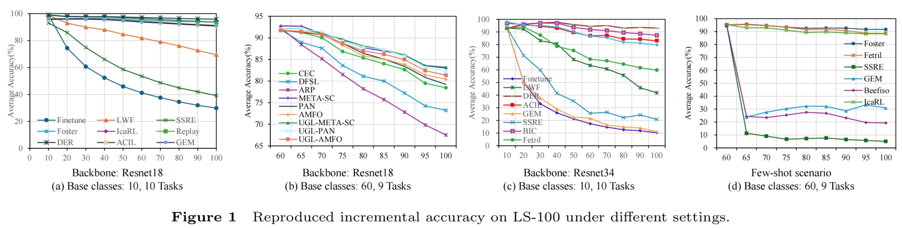

# AudioCIL: A Python Toolbox for Audio Class-Incremental Learning with Multiple Scenes

---

<p align="center">
  <a href="#Introduction">Introduction</a> •
  <a href="#Methods-Reproduced">Methods Reproduced</a> •
  <a href="#Reproduced-Results">Reproduced Results</a> •  
  <a href="#how-to-use">How To Use</a> •
  <a href="#license">License</a> •
  <a href="#Acknowledgments">Acknowledgments</a> •
  <a href="#Contact">Contact</a>
</p>

<div align="center">

</div>

---


<div align="center">

[](https://github.com/yaoyao-liu/class-incremental-learning/blob/master/LICENSE)[](https://www.python.org/) [](https://pytorch.org/) []() [](https://paperswithcode.com/task/incremental-learning)

</div>

Welcome to AudioCIL, perhaps the toolbox for class-incremental learning with the **most** implemented methods. This is the code repository for "AudioCIL: AudioCIL: A Python Toolbox for Audio Class-Incremental Learning with multiple scenes" [[paper]](https://arxiv.org/abs/2412.11907) in PyTorch. If you use any content of this repo for your work, please cite the following bib entries:
```
@article{xu2024AudioCIL,
  title={AudioCIL: A Python Toolbox for Audio Class-Incremental Learning with Multiple Scenes},
  author={Qisheng Xu, Yulin Sun, Yi Su, Qian Zhu, Xiaoyi Tan, Hongyu Wen, Zijian Gao, Kele Xu, Yong Dou, Dawei Feng},
  journal={arXiv preprint arXiv:2412.11907},
  year={2024}
}
```

## Introduction
Deep learning, with its robust aotomatic feature extraction capabilities, has demonstrated significant success in audio signal processing. Typically, these methods rely on static, pre-collected large-scale datasets for training, performing well on a fixed number of classes. However, the real world is characterized by constant change, with new audio classes emerging from streaming or temporary availability due to privacy. This dynamic nature of audio environments necessitates models that can incrementally learn new knowledge for new classes without discarding existing information. Introducing incremental learning to the field of audio signal processing, i.e., Audio Class-Incremental Learning (AuCIL), is a meaningful endeavor. We propose such a toolbox named AudioCIL to align audio signal processing algorithms with real-world scenarios and strengthen research in audio class-incremental learning. Specifically, we develop such a toolbox using the Python programming language, which is widely adopted within the research community. The toolbox includes mainstream CIL methods and is open source with an MIT license.

## Methods Reproduced
In AudioCIL, we have implemented a total of 16 classic and 3 state-of-the-art algorithms for incremental learning.
- `FineTune`: Updates model with new task data, prone to catastrophic forgetting.
- `Replay`: Updates model with a mix of new data and samples from a replay buffer.
- `EWC`: Overcoming catastrophic forgetting in neural networks. PNAS2017 [[paper](https://arxiv.org/abs/1612.00796)]
- `LwF`:Learning without Forgetting.ECCV2016 [[paper](https://arxiv.org/abs/1606.09282)]
- `iCaRL`:  Incremental Classifier and Representation Learning.CVPR2017 [[paper](https://arxiv.org/abs/1611.07725)]
- `GEM`: Gradient Episodic Memory for Continual Learning.NIPS2017 [[paper](https://arxiv.org/abs/1706.08840)]
- `BiC`: Large Scale Incremental Learning.CVPR2019 [[paper](https://arxiv.org/abs/1905.13260)]
- `WA`: Maintaining Discrimination and Fairness in Class Incremental Learning. CVPR2020 [[paper](https://arxiv.org/abs/1911.07053)]
- `POD-Net`: Pooled Outputs Distillation for Small-Tasks Incremental Learning. ECCV2020 [[paper](https://arxiv.org/abs/2004.13513)]
- `DER`: Dynamically Expandable Representation for Class Incremental Learning. CVPR2021 [[paper](https://arxiv.org/abs/2103.16788)]
- `Coil`: Co-Transport for Class-Incremental Learning. ACM MM 2021 [[paper](https://arxiv.org/abs/2107.12654)]
- `ACIL`: Analytic Class-Incremental Learning with Absolute Memorization and Privacy Protection. NeurIPS2022 [[paper](https://arxiv.org/abs/2205.14922)]
- `META-SC`: Few-shot Class-incremental Audio Classification Using Stochastic Classifier. INTERSPEECH2023 [[paper](https://arxiv.org/abs/2306.02053)]
- `PAN`: Few-shot Class-incremental Audio Classification Using Dynamically Expanded Classifier with Self-attention Modified Prototypes. IEEE TMM [[paper](https://arxiv.org/abs/2305.19539)]
- `AMFO`: Few-Shot Class-Incremental Audio Classification With Adaptive Mitigation of Forgetting and Overfitting. [[paper](https://ieeexplore.ieee.org/document/10494541)]

## Reproduced Results
#### LS-100

<div align="center">

</div>

## How To Use

### Clone

Clone this GitHub repository:

```
git clone https://github.com/colaudiolab/AudioCIL.git
cd AudioCIL
```

### Dependencies
1. [librosa](https://github.com/librosa/librosa)
2. [torchaudio](https://github.com/pytorch/audio)
3. [numpy](https://github.com/numpy/numpy)
4. [scipy](https://github.com/scipy/scipy)
5. [torch](https://github.com/pytorch/pytorch)
6. [torchvision](https://github.com/pytorch/vision)
7. [tqdm](https://github.com/tqdm/tqdm)
8. [POT](https://github.com/PythonOT/POT)

### Run experiment

1. Edit the `./exps-audio/[MODEL NAME].json` file for global settings.
2. Edit the hyperparameters in the corresponding `./models/[MODEL NAME].py` file (e.g., `models/acil.py`).
3. Run:

```bash
python main.py --config=./exps-audio/[MODEL NAME].json
```

where [MODEL NAME] should be chosen from `acil`, `beef`, `coil`, `der`, `ds-al`,  `ewc`, `fetril`, `finetune`, `foster`, `gem`, etc.

4. About hyper-parameters

Users can customize AudioCIL by adjusting global parameters and algorithmspecific hyperparameters before executing the main function.

Key global parameters include:

- **memory-size**: Specifies the capacity of the replay buffer used in the incremental learning process.
- **init-cls**: Determines the number of classes in the initial incremental stage. 
- **increment**: The number of classes in each incremental stage $i$, $i$ ⩾ 1.
- **convnet-type**: Selects the backbone network for the incremental model.
- **seed**: Establishes the random seed for shuffling class orders, with a default value of 1993.
- **isfew-shot**: Specifies if the task scenario involves a few-shot learning setting.
- **kshot**: Defines the number of samples per category in the few-shot learning scenario.

Other parameters also can be modified in the corresponding Python file.

### Datasets

We have implemented the pre-processing of `LS100`, `NSynth-100`, etc. When training on `LS100`, this framework will automatically download it.  When training on other datasets, you should specify the folder of your dataset in `utils/data.py`.

```python
    def download_data(self):
        
        train_dataset = LBRS(root="[DATA-PATH]/", phase="train")
        test_dataset = LBRS(root="[DATA-PATH]/", phase="test")

```
[Here](xxxx) is the file list of LS100.


## License
Please check the MIT  [license](./LICENSE) that is listed in this repository.


## Acknowledgments
We thank the following repos providing helpful components/functions in our work.

- [PyCIL](https://github.com/G-U-N/PyCIL/tree/master)
- [FCAC_datasets](https://github.com/chester-w-xie/FCAC_datasets)


## Contact
If there are any questions, please feel free to  propose new features by opening an issue or contact with the author: **Kele Xu** ([xukelele@163.com](mailto:xukelele@163.com)), **Qisheng Xu** ([qishengxu@nudt.edu.cn](mailto:qishengxu@nudt.edu.cn)), **Yulin Sun** ([sunyulin_edu@163.com](mailto:sunyulin_edu@163.com)), **Yi Su** ([email_suyi@163.com](mailto:email_suyi@163.com)), **Qian Zhu** ([zhuqian@nudt.edu.cn](mailto:zhuqian@nudt.edu.cn)), **Xiaoyi Tan** ([350869445@qq.com](mailto:350869445@qq.com)) and **Hongyu Wen** ([wen1223414499@gmail.com](mailto:wen1223414499@gmail.com)).
